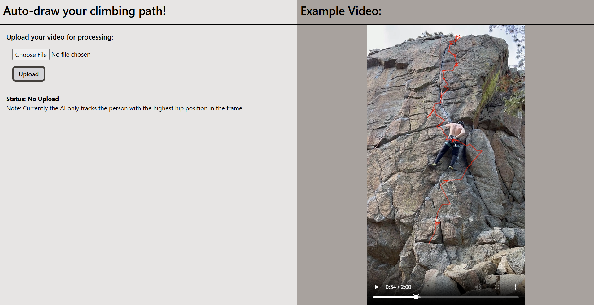
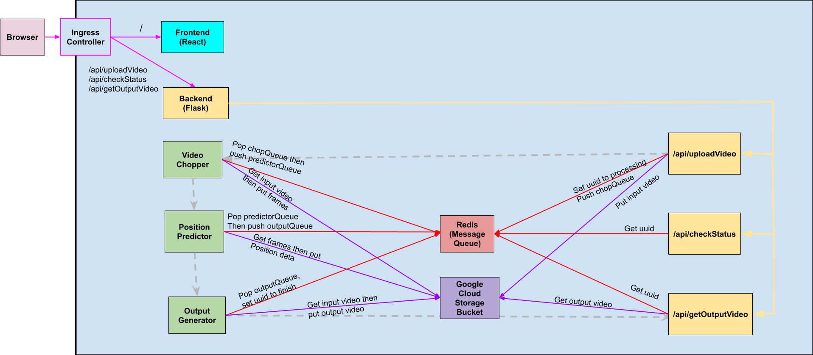

# EZTopo

Final Project Team 122: Bryan Turns and Ian Barnaby

### Important Notes:

1. ONLY CONFIRMED TO BE COMPATIBLE WITH .MP4 VIDEOS!
2. Running this cluster will take significant system resources. I highly encourage you to run ./delete-local.sh whenever you are done using this software.

### Running the Code:

1. Install docker and enable kubernetes
2. Create a google cloud platform account and create a cloud storage bucket named `eztopo-bucket`
3. Create a service account on google cloud platform with storage bucket administrartion privledges and download the service key as 'key.json' and put that in the root directory of the project (same directory as deploy-local.sh). This key will be sent to the services via Kubernetes Secrets which requires some encoding to base64. This is handled by `generatesecret.sh` which is ran by `deploy-local.sh`.
4. Run `deploy-local.sh` to create all the necessary deployments and services. It may take a minute or two for everything to be fully running as most services have to create connections to Google Cloud Platform. NOTE: If you previously ran delete-local.sh note the final line of output and check if it is an error. If so, wait a minute or two and try again.
5. Once the containers are spun up (check with `kubectl get pods`) to http://localhost and you should be presented with the React frontend
6. Upload a video of you climbing (or use ./example-videos/example1.mp4) and your traced path will display in the right column
7. When you're done run `delete-local.sh` to remove all deployments and services being ran by kubernetes. NOTE: You will not be able to immediately re-spin up the deployments as the nginx namespace is being deleted.

What you should see once you go to http://localhost:

### Project Structure:

1. The frontend is under the web-server directory. Refer to ./web-server/README.md for more information. The frontend is only responsible for getting, sending, and displaying user data.
2. The backend REST server is under the rest-server directory. Refer to ./rest-server for more information. The REST service is responsible for storing the raw video, making calls to the frame-chopper service, and retrieving the output video.
3. The conversion of video to topology is under the data-processing directory. Refer to ./data-processing for more information.
4. The message queue is under message-queue. Refer to ./message-queue/README.md for more information. It is currently implemented with Redis.
5. Networking (ingress) is done under ./networking. Refer to ./networking/README.md for more information. It is currently implemented with ngix.

Diagram of the architecture:

