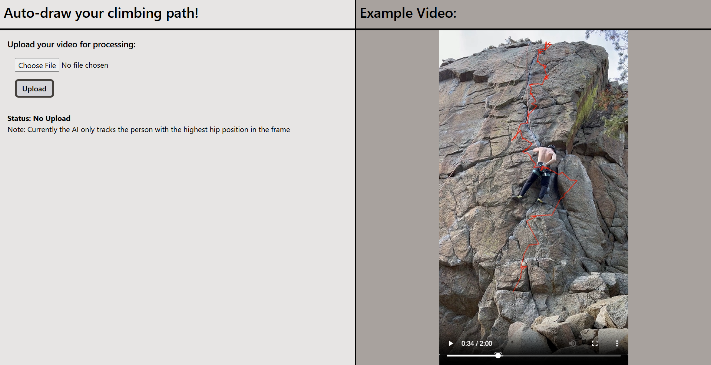

# EZTopo

Final Project Team 122: Bryan Turns and Ian Barnaby

Upload a video of yourself climbing and get it back with your path traced onto it.

### Important Notes:

1. ONLY CONFIRMED TO BE COMPATIBLE WITH .MP4 VIDEOS!
2. Pose estimation runs on the CPU, so processing a video takes a while and will use every core you give it.

### Architecture

Two pieces:

1. **`backend/`** — a single Docker image. A Flask API plus the three processing
   stages (chop, predict, draw) running as worker threads inside the same
   process. It has no external dependencies: no database, no message broker, no
   cloud storage, no credentials.
2. **`web-server/`** — a React app that is built to static files and served by
   whatever web server you already have. It is not containerised.

Data flow: the API saves the upload and hands its UUID to the chopper, which
samples a frame every second and passes them to the predictor, which runs the
Ultralytics YOLO pose model and records the hip position of the highest person
in each frame (the climber, not the belayer). The output generator then draws
those positions as a line onto every frame of the original video and re-encodes
it as H.264. The frontend polls `/api/checkStatus` throughout and downloads the
result when the status reaches 9.

### Running the backend

```bash
docker build -t eztopo-backend ./backend
docker run -d --name eztopo-backend -p 5000:5000 -v eztopo-data:/data eztopo-backend
```

`/data` holds uploads, sampled frames, the position JSON and finished videos.
Mounting a volume there is optional — without one, results are lost when the
container is removed. Job status is held in memory either way, so anything still
processing is lost on a restart.

As a compose service:

```yaml
services:
  eztopo-backend:
    build: ./backend
    ports:
      - "5000:5000"
    volumes:
      - eztopo-data:/data

volumes:
  eztopo-data:
```

See [backend/README.md](./backend/README.md) for the routes, the status codes and
the tunable environment variables.

### Building the frontend

```bash
cd web-server
npm install
npm run build
```

Serve the resulting `build/` directory as static content and proxy `/api` to the
backend, so both are on the same origin:

```nginx
server {
    listen 80;
    root /path/to/web-server/build;

    location / {
        try_files $uri /index.html;
    }

    location /api/ {
        proxy_pass http://eztopo-backend:5000;
        client_max_body_size 1000m;
        proxy_request_buffering off;
        proxy_read_timeout 3600s;
    }
}
```

The upload limit and read timeout matter: videos are large and a request can sit
open for a long time. If you would rather point the frontend at a backend on a
different origin, build with `REACT_APP_API_BASE_URL=http://host:5000`.

There is a video to try under `./example-videos`.

What you should see once the frontend is up:

